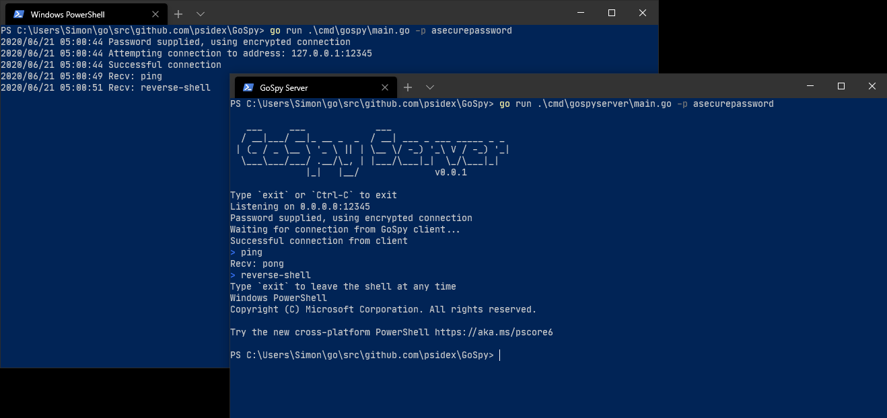

<h1 align="center">GoSpy</h1>

    
     
    
    
     
    
    
    

A cross-platform post-exploitation tool for penetration testing

## Disclaimer

This project should be used for authorized testing or educational purposes only.

It is the final user's responsibility to obey all applicable local, state, and federal laws.

Authors assume no liability and are not responsible for any misuse or damage caused by this program.

## Usage

GoSpy consists of 2 binaries, `gospy` is what you execute on your target machine and `gospyserver` is what you run on
your machine to interact with it.

## Features

These are almost all currently a WIP

- [x] Cross-platform with `CGO_ENABLED=0` (compiles to any target that Go supports)
- [x] Basic plaintext communication over TCP sockets
- [x] AES-256 encrypted communication over TCP sockets using a shared password
  - Note: This will cause a noticeable increase in response times
- [x] Safe error handling so the client / server won't suddenly drop on error
- [x] Automatic reconnect for both client and server
- [x] Reverse shell
- [ ] Screen grab
- [ ] File grab
- [ ] File drop
- [ ] Execute Lua scripts on target machine (using [gopher-lua](https://github.com/yuin/gopher-lua))
- [ ] More?

## Screenshot

## Why?

I wrote this project to learn more about both Go and penetration testing, as I recently completed an "Ethical Hacking"
unit for my university course and am interested in learning more.

## Credits

- Icon from [gopherize.me](https://gopherize.me/)
- [c-bata/go-prompt](https://github.com/c-bata/go-prompt/) for the interactive prompt on the server
- [JP Bruins Slot](https://itnext.io/encrypt-data-with-a-password-in-go-b5366384e291) for most of the encryption code
- [vfedoroff/go-netcat](https://github.com/vfedoroff/go-netcat/blob/master/main.go) for some of the reverse shell network logic
